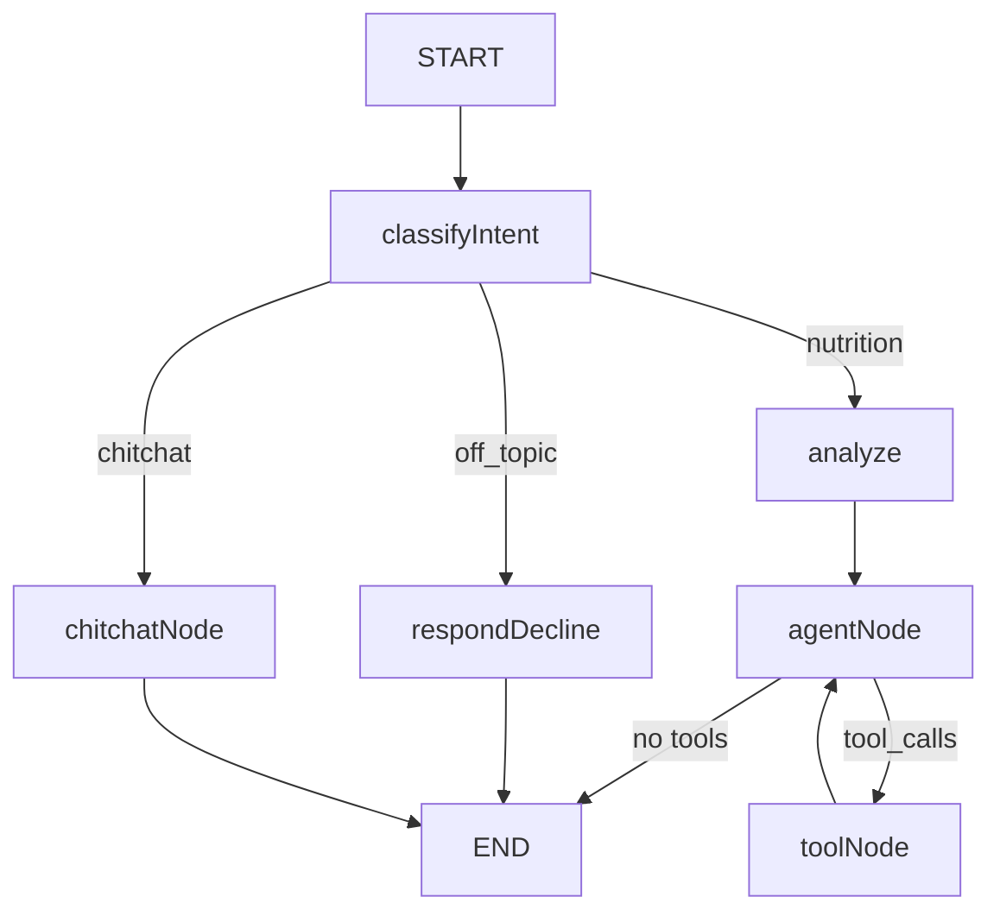

# NutriGuide AI Agent (TypeScript)

Custom LangGraph StateGraph-based nutrition assistant with RAG (Pinecone) and tools. Uses routing (nutrition, chitchat, off-topic), multi-step reasoning (analyze node), and an agent loop with MemorySaver for session-scoped conversation memory.

## Architecture



- **classifyIntent**: Routes to respondDecline (off-topic), chitchatNode (greetings/small talk), or analyze (nutrition)
- **respondDecline**: Polite decline for non-nutrition questions
- **chitchatNode**: Short friendly reply for greetings and small talk (no tools, no RAG)
- **analyze**: Multi-step reasoning before agent (what user needs, search focus)
- **agentNode**: LLM with tools (get_user_profile, get_user_behavioural, search_nutrition_knowledge, search_foods)
- **toolNode**: Executes tool calls, loops back to agentNode

## Chat API

`POST /chat` — Request: `{ user_id, message, thread_id }`. Returns `{ response }` with the final AI output only (extracted from the last assistant message; intermediate tool outputs, user profile dumps, and RAG content are not included). The user ID is passed to the agent via a system message so it never appears in chat bubbles. The agent fetches user profiles from the backend via its tools (no `user_profiles` in the request).

## Project structure (src/agent/)

| File | Description |
|------|-------------|
| `state.ts` | Annotation.Root state schema (messages, user_id, classification, analysis) |
| `nodes.ts` | classifyIntent, respondDecline, chitchatNode, analyze, agentNode, toolNode |
| `graph.ts` | StateGraph, edges, MemorySaver |
| `tools.ts` | getUserProfile, getUserBehavioural, searchNutritionKnowledge (RAG), searchFoods (USDA FDC) |
| `rag.ts` | Pinecone RAG (embeddings, retriever) |
| `index.ts` | Exports graph and tools |

## Setup

```bash
npm install
npm run build
```

## Index knowledge (when adding/changing .md files)

```bash
npm run index
```

Run this when you add or change files in `knowledge/`. The agent reads from a pre-populated Pinecone index; it does not index at runtime. In CI, indexing runs automatically when `ai-agent-ts/knowledge/` changes.

## Run

```bash
# Requires PINECONE_API_KEY and PINECONE_INDEX in .env (create index at app.pinecone.io)
AGENT_PORT=8000 npm start
```

Or use the project's `docker-compose.yml` which includes the agent.

## Environment

- `OPENAI_API_KEY` — Required
- `PINECONE_API_KEY` — Required for RAG
- `PINECONE_INDEX` — Pinecone index name (default: nutriguide-app-knowledge)
- `AGENT_PORT` — Server port (required)
- `BACKEND_URL` — Backend base URL for fetching profiles (default: http://localhost:3001; use http://backend:3001 in Docker)
- `INTERNAL_API_KEY` — Required for agent-backend auth (must match backend)
- `LANGSMITH_*` — Optional LangSmith tracing
