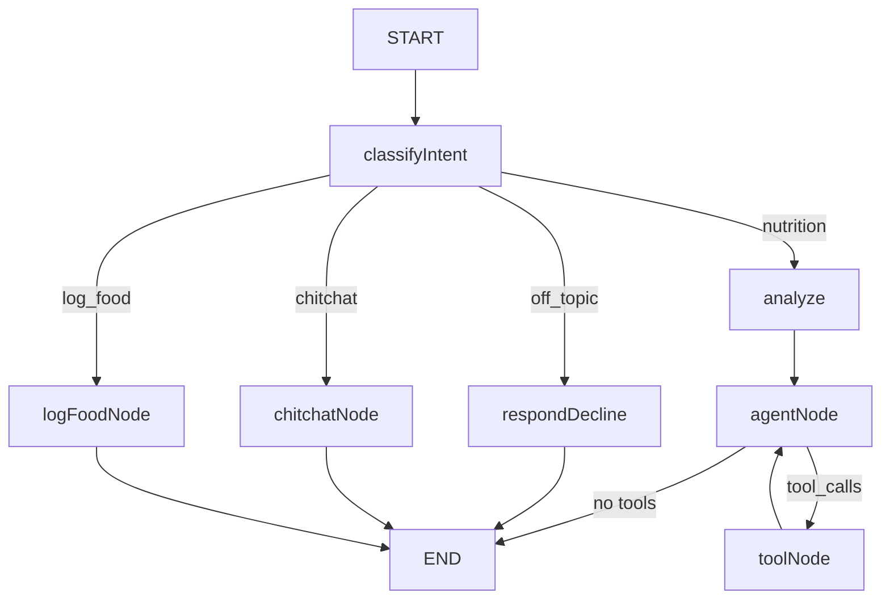

# NutriGuide AI Agent (TypeScript)

Custom LangGraph StateGraph-based nutrition assistant with RAG (Pinecone) and tools. Uses routing (nutrition, chitchat, off-topic, log_food), multi-step reasoning (analyze node), and an agent loop with MemorySaver for session-scoped conversation memory. Food logging uses LangGraph interrupts so the user can reply "1" or "2" to confirm options without re-classification.

## Architecture



- **classifyIntent**: Routes to respondDecline (off-topic), chitchatNode (greetings/small talk), logFoodNode (log/add food), or analyze (nutrition)
- **respondDecline**: Polite decline for non-nutrition questions
- **chitchatNode**: Short friendly reply for greetings and small talk (no tools, no RAG)
- **logFoodNode**: Direct path for food logging (e.g. "log 100g chicken for lunch"). Uses `request_food_log_confirmation` with LangGraph interrupt—pauses for user to reply "1"/"2"/"cancel", then appends to or creates the log. Multiple foods for the same meal are merged into one log.
- **analyze**: Multi-step reasoning before agent (what user needs, search focus)
- **agentNode**: LLM with tools (get_user_profile, get_user_behavioural, get_calorie_goal, search_nutrition_knowledge, search_foods, request_food_log_confirmation)
- **toolNode**: Executes tool calls, loops back to agentNode

## Chat API

`POST /chat` — Request: `{ user_id, message, thread_id }`. Returns `{ response }` or `{ response, interrupted: true }` when the agent pauses for food log confirmation. The response contains the final AI output (extracted from the last assistant message; intermediate tool outputs, user profile dumps, and RAG content are not included). When `interrupted` is true, the client should display the options and send the user's next reply (e.g. "1" or "2") in a follow-up request with the same `thread_id`—the agent resumes with that value and creates the log. The user ID is passed to the agent via a system message so it never appears in chat bubbles.

## Project structure (src/agent/)

| File | Description |
|------|-------------|
| `state.ts` | Annotation.Root state schema (messages, user_id, classification, analysis) |
| `nodes.ts` | classifyIntent, respondDecline, chitchatNode, logFoodNode, analyze, agentNode, toolNode |
| `graph.ts` | StateGraph, edges, MemorySaver |
| `tools.ts` | getUserProfile, getUserBehavioural, getCalorieGoal, searchNutritionKnowledge (RAG), searchFoods (USDA FDC), requestFoodLogConfirmation (interrupt-based logging) |
| `rag.ts` | Pinecone RAG (embeddings, retriever) |
| `index.ts` | Exports graph and tools |
| `scripts/test-chat-direct.ts` | Direct agent test (bypasses HTTP); run with `npm run test:chat` |

## Setup

```bash
npm install
npm run build
```

## Index knowledge (when adding/changing .md files)

```bash
npm run index
```

Run this when you add or change files in `knowledge/`. The agent reads from a pre-populated Pinecone index; it does not index at runtime. In CI, indexing runs automatically when `ai-agent-ts/knowledge/` changes.

## Run

```bash
# Requires PINECONE_API_KEY and PINECONE_INDEX in .env (create index at app.pinecone.io)
AGENT_PORT=8000 npm start
```

Or use the project's `docker-compose.yml` which includes the agent.

## Test (direct agent)

```bash
npm run test:chat
```

Runs a two-turn test: "log 100g chicken for lunch" → interrupt → resume with "1" → logs food. Useful for verifying the interrupt flow without the UI.

## Environment

- `OPENAI_API_KEY` — Required
- `PINECONE_API_KEY` — Required for RAG
- `PINECONE_INDEX` — Pinecone index name (default: nutriguide-app-knowledge)
- `AGENT_PORT` — Server port (required)
- `BACKEND_URL` — Backend base URL for fetching profiles (default: http://localhost:3001; use http://backend:3001 in Docker)
- `INTERNAL_API_KEY` — Required for agent-backend auth (must match backend)
- `LANGSMITH_*` — Optional LangSmith tracing
