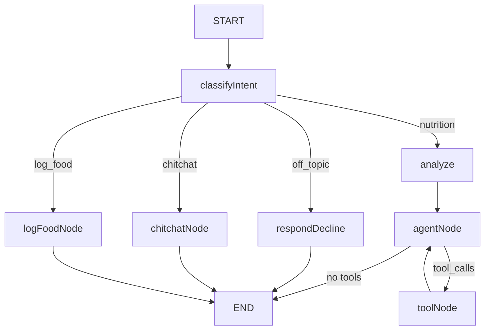

# NutriGuide AI Agent (TypeScript)

Custom LangGraph StateGraph-based nutrition assistant with RAG (Pinecone) and tools. Uses routing (nutrition, chitchat, off-topic, log_food), multi-step reasoning (analyze node), and an agent loop with a Postgres-backed `PostgresSaver` checkpointer so conversation memory and in-flight interrupts survive process restarts and redeploys. Food logging uses LangGraph interrupts so the user can reply "1" or "2" to confirm options without re-classification.

## Architecture


```mermaid
flowchart TD
    START --> classifyIntent
    classifyIntent -->|off_topic| respondDecline
    classifyIntent -->|chitchat| chitchatNode
    classifyIntent -->|log_food| logFoodNode
    classifyIntent -->|nutrition| analyze
    analyze --> agentNode
    agentNode -->|tool_calls| toolNode
    toolNode --> agentNode
    agentNode -->|no tools| END
    respondDecline --> END
    chitchatNode --> END
    logFoodNode --> END
```

- **classifyIntent**: Routes to respondDecline (off-topic), chitchatNode (greetings/small talk), logFoodNode (log/add food), or analyze (nutrition)
- **respondDecline**: Polite decline for non-nutrition questions
- **chitchatNode**: Short friendly reply for greetings and small talk (no tools, no RAG)
- **logFoodNode**: Direct path for food logging (e.g. "log 100g chicken for lunch", "add 1 cup rice for dinner", "log 2 servings oatmeal for breakfast"). Uses `request_food_log_confirmation` with LangGraph interrupt—pauses for user to reply "1"/"2"/"cancel", then appends to or creates the log. Accepts grams or amount+unit (cup, cups, serving, servings, oz, tbsp, tsp, piece, slice). Multiple foods for the same meal are merged into one log.
- **analyze**: Multi-step reasoning before agent (what user needs, search focus)
- **agentNode**: LLM with tools (get_user_profile, get_user_behavioural, get_calorie_goal, search_nutrition_knowledge, search_foods, request_food_log_confirmation)
- **toolNode**: Executes tool calls, loops back to agentNode

## Chat API

`POST /chat` — Request: `{ user_id, message, thread_id }`. Returns `{ response }` or `{ response, interrupted: true }` when the agent pauses for food log confirmation. The response contains the final AI output (extracted from the last assistant message; intermediate tool outputs, user profile dumps, and RAG content are not included). When `interrupted` is true, the client should display the options and send the user's next reply (e.g. "1" or "2") in a follow-up request with the same `thread_id`—the agent resumes with that value and creates the log. The user ID is passed to the agent via a system message so it never appears in chat bubbles.

## Project structure (src/)

| Path | Description |
|------|-------------|
| `agent/state.ts` | Annotation.Root state schema (messages, user_id, classification, analysis) |
| `agent/nodes.ts` | classifyIntent, respondDecline, chitchatNode, logFoodNode, analyze, agentNode, toolNode |
| `agent/graph.ts` | StateGraph, edges, PostgresSaver checkpointer |
| `agent/tools.ts` | getUserProfile, getUserBehavioural (food logs + weight trend), getCalorieGoal, searchNutritionKnowledge (RAG), searchFoods (USDA FDC), requestFoodLogConfirmation (interrupt-based logging; accepts grams or amount+unit) |
| `agent/rag.ts` | Pinecone RAG (embeddings, retriever) |
| `agent/index.ts` | Exports graph and tools |
| `eval/dataset.ts` | Evaluation examples (intent, off-topic, chitchat, log-food, nutrition) |
| `eval/target.ts` | Target function that invokes the graph for evaluation |
| `eval/evaluators.ts` | Evaluators (intent, off-topic, chitchat, log-food, agentevals trajectory match for tool selection, LLM-as-judge for response quality) |
| `scripts/test-chat-direct.ts` | Direct agent test (bypasses HTTP); run with `npm run test:chat` |
| `scripts/run-eval.ts` | Offline evaluation runner; run with `npm run eval` |

## Setup

```bash
npm install
npm run build
```

## Index knowledge (when adding/changing .md files)

```bash
npm run index
```

Run this when you add or change files in `knowledge/`. The agent reads from a pre-populated Pinecone index; it does not index at runtime. In CI, indexing runs automatically when `ai-agent-ts/knowledge/` changes.

## Run

```bash
# Requires PINECONE_API_KEY and PINECONE_INDEX in .env (create index at app.pinecone.io)
AGENT_PORT=8000 npm start
```

Or use the project's `docker-compose.yml` which includes the agent.

## Test (direct agent)

```bash
npm run test:chat
```

Runs a two-turn test: "log 100g chicken for lunch" → interrupt → resume with "1" → logs food. Useful for verifying the interrupt flow without the UI. The agent also supports amount+unit (e.g. "log 1 cup rice for dinner").

## Evaluation

```bash
npm run eval
```

Runs offline evaluation on a curated dataset (~43 examples) covering intent classification, off-topic handling, chitchat, log-food parsing, tool selection, and final response quality.

**Prerequisites:** Backend running at `BACKEND_URL`, and `OPENAI_API_KEY`, `BACKEND_URL`, `INTERNAL_API_KEY`, `PINECONE_*` in `.env`.

**Two modes**, chosen automatically:
- **LangSmith mode** (when `LANGSMITH_TRACING_V2=true` and `LANGSMITH_API_KEY` are set): syncs the dataset in `eval/dataset.ts` to a LangSmith dataset (`nutriguide-agent-eval`, wiped and recreated each run so it never drifts from the code) and runs it through LangSmith's `evaluate()`. Produces a real experiment in the LangSmith UI (project from `LANGSMITH_PROJECT`) with per-example traces and scores, in addition to the console summary.
- **Local mode** (no LangSmith env vars): runs the same evaluators in a local loop, console output only.

**Evaluators:**

| Evaluator | Measures |
|-----------|----------|
| intent_correct | Intent classification matches expected (chitchat, off_topic, log_food, nutrition) |
| off_topic_handled | Off-topic responses redirect to nutrition and are brief |
| chitchat_appropriate | Chitchat responses are friendly and invite nutrition questions |
| log_food_parsed | Log-food messages parse correctly (search_query, grams/amount+unit, meal_type) |
| right_tools_called | Agent's tool-call trajectory is a superset of the expected tools for the question, via `agentevals`' `createTrajectoryMatchEvaluator` (tool args ignored - this checks *which* tools ran, not their exact arguments) |
| response_quality_judge | LLM-as-judge (`gpt-4o-mini`, structured output): grades whether the response is grounded and actually addresses the question, against a golden `reference_answer` in the dataset - not a length/keyword heuristic |

Dataset and evaluators live in `src/eval/`. Not yet wired into CI (`deploy.yml`) - the nutrition/log-food examples need a live backend+DB, which the CI runner doesn't have; that's a separate follow-up (standing up service containers + a seeded eval user).

## Environment

- `OPENAI_API_KEY` — Required
- `PINECONE_API_KEY` — Required for RAG
- `PINECONE_INDEX` — Pinecone index name (default: nutriguide-app-knowledge)
- `AGENT_PORT` — Server port (required)
- `DATABASE_URL` — Required; the LangGraph checkpointer (`PostgresSaver`) persists conversation state and in-flight interrupts to this Postgres database (same instance as the backend, separate tables). The process throws on startup if unset.
- `BACKEND_URL` — Backend base URL for fetching profiles (default: http://localhost:3001; use http://backend:3001 in Docker)
- `INTERNAL_API_KEY` — Required for agent-backend auth (must match backend)
- `LANGSMITH_*` — Optional LangSmith tracing
