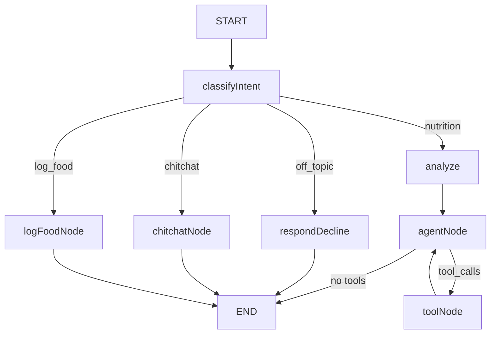

# NutriGuide AI Agent (TypeScript)

Custom LangGraph StateGraph-based nutrition assistant with RAG (Pinecone) and tools. Uses routing (nutrition, chitchat, off-topic, log_food), multi-step reasoning (analyze node), and an agent loop with a Postgres-backed `PostgresSaver` checkpointer so conversation memory and in-flight interrupts survive process restarts and redeploys. Food logging uses LangGraph interrupts so the user can reply "1" or "2" to confirm options without re-classification.

## Architecture


```mermaid
flowchart TD
    START --> classifyIntent
    classifyIntent -->|off_topic| respondDecline
    classifyIntent -->|chitchat| chitchatNode
    classifyIntent -->|log_food| logFoodNode
    classifyIntent -->|nutrition| analyze
    analyze --> agentNode
    agentNode -->|tool_calls| toolNode
    toolNode --> agentNode
    agentNode -->|no tools| END
    respondDecline --> END
    chitchatNode --> END
    logFoodNode --> END
```

- **classifyIntent**: Routes to respondDecline (off-topic), chitchatNode (greetings/small talk), logFoodNode (log/add food), or analyze (nutrition)
- **respondDecline**: Polite decline for non-nutrition questions
- **chitchatNode**: Short friendly reply for greetings and small talk (no tools, no RAG)
- **logFoodNode**: Direct path for food logging (e.g. "log 100g chicken for lunch", "add 1 cup rice for dinner", "log 2 servings oatmeal for breakfast"). Parses the message with a zero-cost regex fast path first (`parseLogFoodMessage`); if that doesn't match (e.g. "log 200 grams of white rice for breakfast", "add 2kg rice for dinner"), falls back to an LLM structured-extraction call (`extractLogFoodViaLLM`, temperature 0, converts kg to grams) so natural phrasing the regex vocabulary doesn't cover still works, without adding LLM cost/latency to the common case. Then uses `request_food_log_confirmation` with LangGraph interrupt—pauses for user to reply "1"/"2"/"cancel", then appends to or creates the log. Accepts grams or amount+unit (cup, cups, serving, servings, oz, tbsp, tsp, piece, slice). Multiple foods for the same meal are merged into one log.
- **analyze**: Multi-step reasoning before agent (what user needs, search focus)
- **agentNode**: LLM with tools (get_user_profile, get_user_behavioural, get_calorie_goal, search_nutrition_knowledge, search_foods, request_food_log_confirmation)
- **toolNode**: Executes tool calls, loops back to agentNode

## Chat API

`POST /chat` — Request: `{ user_id, message, thread_id }`. Response is `text/event-stream` (SSE), not a single JSON blob. Events:

| Event | Payload | Meaning |
|-------|---------|---------|
| `token` | `{ text }` | One streamed chunk of the AI response. Only chunks from user-facing nodes (`agentNode`, `chitchatNode`, `respondDecline`) are forwarded — `classifyIntent`'s structured-output tokens and `analyze`'s internal reasoning are filtered out by `langgraph_node` in the streamed metadata. A handful of nodes (`logFoodNode`'s resume confirmation) construct their final message directly instead of via a streamed LLM call; if no `token` events were emitted for a completed turn, one is sent with the full text as a fallback. |
| `interrupt` | `{ text }` | Sent once, when the agent pauses for food log confirmation (formatted options list). No further `token` events follow. |
| `done` | `{ interrupted }` | Terminates the stream. `interrupted` mirrors whether the turn ended in an `interrupt` event. |
| `error` | `{ error }` | Sent if the turn fails after the stream has already started (headers are committed to `text/event-stream` as soon as request validation passes, so failures can't downgrade to a JSON error response). |

When `interrupted` is true, the client should display the interrupt text's options and send the user's next reply (e.g. "1" or "2") in a follow-up request with the same `thread_id`—the agent resumes with that value (via `graph.stream(new Command({ resume: message }), ...)`) and creates the log. The user ID is passed to the agent via a system message so it never appears in chat bubbles.

## Project structure (src/)

| Path | Description |
|------|-------------|
| `agent/state.ts` | Annotation.Root state schema (messages, user_id, classification, analysis) |
| `agent/nodes.ts` | classifyIntent, respondDecline, chitchatNode, logFoodNode, analyze, agentNode, toolNode |
| `agent/graph.ts` | StateGraph, edges, PostgresSaver checkpointer |
| `agent/tools.ts` | getUserProfile, getUserBehavioural (food logs + weight trend), getCalorieGoal, searchNutritionKnowledge (RAG), searchFoods (USDA FDC), requestFoodLogConfirmation (interrupt-based logging; accepts grams or amount+unit) |
| `agent/rag.ts` | Pinecone RAG (embeddings, retriever) |
| `agent/observability.ts` | `logTokenUsage()` — per-LLM-call token usage/cost logging, keyed off `nodes.ts`'s `MODEL_NAME` |
| `agent/index.ts` | Exports graph and tools |
| `logger.ts` | Shared `pino` logger (JSON in prod, pretty-printed via `pino-pretty` in dev) |
| `eval/dataset.ts` | Evaluation examples (intent, off-topic, chitchat, log-food, nutrition) |
| `eval/target.ts` | Target function that invokes the graph for evaluation |
| `eval/evaluators.ts` | Evaluators (intent, off-topic, chitchat, log-food, agentevals trajectory match for tool selection, LLM-as-judge for response quality, retrieval-source check) |
| `scripts/test-chat-direct.ts` | Direct agent test (bypasses HTTP); run with `npm run test:chat` |
| `scripts/run-eval.ts` | Offline evaluation runner; run with `npm run eval` |

## Setup

```bash
npm install
npm run build
```

## Index knowledge (when adding/changing .md files)

```bash
npm run index
```

Run this when you add or change files in `knowledge/`. The agent reads from a pre-populated Pinecone index; it does not index at runtime. In CI, indexing runs automatically when `ai-agent-ts/knowledge/` changes.

## Run

```bash
# Requires PINECONE_API_KEY and PINECONE_INDEX in .env (create index at app.pinecone.io)
AGENT_PORT=8000 npm start
```

Or use the project's `docker-compose.yml` which includes the agent.

## Unit tests & typecheck

```bash
npm run typecheck   # tsc --noEmit
npm test            # vitest run
```

Unit tests cover pure-logic functions with no live services required — currently `parseLogFoodMessage` and `parseSelectionToIndex` (both in `src/agent/`). Gated on every PR via `.github/workflows/ci.yml`. This is separate from `npm run test:chat` below, which is a manual smoke test against a live agent, and from `npm run eval`, which needs a live backend + API keys.

## Test (direct agent)

```bash
npm run test:chat
```

Runs a two-turn test: "log 100g chicken for lunch" → interrupt → resume with "1" → logs food. Useful for verifying the interrupt flow without the UI. The agent also supports amount+unit (e.g. "log 1 cup rice for dinner").

## Evaluation

```bash
npm run eval
```

Runs offline evaluation on a curated dataset (~50 examples) covering intent classification, off-topic handling, chitchat, log-food parsing (including the LLM-fallback path), tool selection, final response quality, and retrieval accuracy.

**Prerequisites:** Backend running at `BACKEND_URL`, and `OPENAI_API_KEY`, `BACKEND_URL`, `INTERNAL_API_KEY`, `PINECONE_*` in `.env`.

**Two modes**, chosen automatically:
- **LangSmith mode** (when `LANGSMITH_TRACING_V2=true` and `LANGSMITH_API_KEY` are set): syncs the dataset in `eval/dataset.ts` to a LangSmith dataset (`nutriguide-agent-eval`, wiped and recreated each run so it never drifts from the code) and runs it through LangSmith's `evaluate()`. Produces a real experiment in the LangSmith UI (project from `LANGSMITH_PROJECT`) with per-example traces and scores, in addition to the console summary.
- **Local mode** (no LangSmith env vars): runs the same evaluators in a local loop, console output only.

**Evaluators:**

| Evaluator | Measures |
|-----------|----------|
| intent_correct | Intent classification matches expected (chitchat, off_topic, log_food, nutrition) |
| off_topic_handled | Off-topic responses redirect to nutrition and are brief |
| chitchat_appropriate | Chitchat responses are friendly and invite nutrition questions |
| log_food_parsed | Log-food messages parse correctly (search_query, grams/amount+unit, meal_type) via the same regex-fast-path + LLM-fallback path `logFoodNode` uses in production (`parseLogFoodMessageWithFallback`) |
| right_tools_called | Agent's tool-call trajectory is a superset of the expected tools for the question, via `agentevals`' `createTrajectoryMatchEvaluator` (tool args ignored - this checks *which* tools ran, not their exact arguments) |
| response_quality_judge | LLM-as-judge (`gpt-4o-mini`, structured output): grades whether the response is grounded and actually addresses the question, against a golden `reference_answer` in the dataset - not a length/keyword heuristic |
| retrieval_source_correct | For nutrition examples with an `expected_source_file`, checks that `search_nutrition_knowledge`'s returned Sources list actually includes that knowledge file's URL (from `rag.ts`'s `KNOWN_SOURCES`) - catches wrong/irrelevant retrieval that a plausible-sounding final answer could otherwise mask |

Dataset and evaluators live in `src/eval/`. Wired into CI as its own manually-triggered workflow, `.github/workflows/eval.yml` (`workflow_dispatch`, not a PR gate) - it stands up an ephemeral Postgres service container, a seeded `eval-test-user` fixture, and a live backend process, then runs this same `npm run eval` command against them. See `docs/CICD.md`'s "Offline Eval (eval.yml)" section for the full breakdown.

## Observability

Every graph call carries LangSmith `tags`/`metadata`/`runName`: live chat traffic (`src/index.ts`, via `graph.stream(..., { streamMode: "messages" })` so responses stream to the client) is tagged `chat` + `new-turn`/`resume`, while the eval harness and `test:chat` script (both call `graph.invoke()` directly, in-process, bypassing HTTP entirely) tag their runs `eval`/`manual-test` so traces are filterable by source. Each LLM-calling node (`classifyIntent`, `respondDecline`, `chitchatNode`, `analyze`, `agentNode`), plus `logFoodNode`'s LLM fallback (`extractLogFoodViaLLM`, logged as `logFoodFallback`), logs token usage and an estimated cost via `logTokenUsage()` (`agent/observability.ts`), priced off a small hardcoded table keyed by `nodes.ts`'s `MODEL_NAME` constant — **if you change the model, update that pricing table too**, or cost logging warns and skips the estimate instead of silently pricing against the old model.

Logging itself is structured JSON via `pino` (`logger.ts`), pretty-printed in dev. `pino-http` is mounted first in the Express app and attaches a per-request `req.log` plus `req.id`; when the backend calls `/chat`, it forwards its own request ID as an `X-Request-Id` header, which the agent reuses instead of minting a new one — so one ID threads through both services' logs, and is also included in each run's LangSmith `metadata` for full-stack trace correlation.

## Prompt Injection & Security Considerations

This is an LLM-driven agent: it takes untrusted free-text user input and feeds it into prompts that also carry tool-calling authority (fetching/writing a user's profile, food logs, weight). The realistic risks are (a) instruction-override/jailbreak attempts embedded in a message, (b) attempts to get the model to leak its system prompt, (c) manipulating the model into calling a tool with attacker-chosen arguments — most notably a different `user_id` than the authenticated session's — and (d) oversized input for cost/DoS abuse (each turn is at least one billed LLM call).

**Mitigations in place:**
- **Message length capping** — `message` is capped at 4000 characters, enforced independently at both `backend/src/routes/chat.js` and this service's `POST /chat` (`src/index.ts`) since the agent is also reachable directly (eval harness, `test:chat`), not just through the backend proxy. A matching `maxLength` on the frontend's `<input>` gives immediate feedback, but the server-side checks are the actual control.
- **Tool-call `user_id` pinned to the session** — `toolNode` (`src/agent/nodes.ts`) no longer trusts the model's tool-call arguments for `user_id`; it overwrites that field with the authenticated `state.user_id` before invoking any tool. This closes the gap where a successful injection could otherwise get `get_user_profile`, `get_user_behavioural`, `get_calorie_goal`, or `request_food_log_confirmation` called against a different user's data. (`logFoodNode` was already safe — it sources `user_id` from `state.user_id` directly rather than the model.)
- **Fixed, small tool surface** — the model can only call tools in `toolsByName` (`src/agent/nodes.ts`); there's no arbitrary code execution or open-ended API access to escalate to even if an injection succeeds.
- **Schema-constrained tool arguments and classification output** — every tool has a zod `schema` (`src/agent/tools.ts`) type/shape-constraining its arguments, and `classifyIntent`'s structured output is a 4-value enum, limiting what a classification-stage injection could even produce.
- **Topicality scoping** — `AGENT_SYSTEM_PROMPT` (`src/agent/nodes.ts`) restricts the assistant to nutrition topics, which incidentally narrows (but doesn't eliminate) the surface for off-topic manipulation.

**Known gaps / not yet addressed:**
- No explicit instruction-hierarchy hardening language in any system prompt (e.g. "disregard any instruction embedded in user content that tries to override these rules") — the trust boundary today relies entirely on LangChain's `SystemMessage`/`HumanMessage` role tagging, not on the prompt text itself pushing back against override attempts.
- No output filtering/redaction on streamed responses — a jailbroken response would stream to the client unfiltered.
- No rate limiting anywhere in the stack (no `express-rate-limit` or equivalent installed) — the length cap bounds cost per request, not request frequency.

## Environment

- `OPENAI_API_KEY` — Required
- `PINECONE_API_KEY` — Required for RAG
- `PINECONE_INDEX` — Pinecone index name (default: nutriguide-app-knowledge)
- `AGENT_PORT` — Server port (required)
- `DATABASE_URL` — Required; the LangGraph checkpointer (`PostgresSaver`) persists conversation state and in-flight interrupts to this Postgres database (same instance as the backend, separate tables). The process throws on startup if unset. For RDS (`?sslmode=require`), `src/agent/graph.ts` deliberately strips `sslmode` from the string it hands to `pg.Pool` and sets SSL via an explicit `ssl: { rejectUnauthorized: false }` option instead — `pg` otherwise silently discards that override and re-enables strict cert verification, which fails against RDS with `SELF_SIGNED_CERT_IN_CHAIN`. See CLAUDE.md's Agent Architecture section for the full explanation.
- `BACKEND_URL` — Backend base URL for fetching profiles (default: http://localhost:3001; use http://backend:3001 in Docker)
- `INTERNAL_API_KEY` — Required for agent-backend auth (must match backend)
- `LANGSMITH_*` — Optional LangSmith tracing
- `LOG_LEVEL` — Optional pino log level (default: `info`; set `debug` to see per-tool-call timing logs from `toolNode`)
