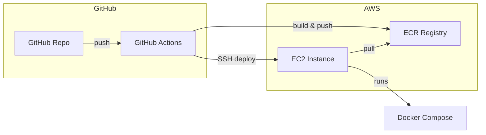

# NutriGuide-AI Deployment Guide

## Overview

NutriGuide-AI is deployed to AWS using EC2, ECR, GitHub Actions, and Docker Compose. The pipeline builds Docker images, pushes them to Amazon ECR, and deploys to an EC2 instance via SSH.

## Tech Stack

| Component | Technology |
|-----------|------------|
| Frontend | React, Vite, Nginx |
| Backend | Node.js, Express |
| AI Agent | TypeScript, Express, LangGraph.js, LangChain |
| RAG | Pinecone (cloud vector store) |
| Registry | AWS ECR |
| Compute | AWS EC2 |
| CI/CD | GitHub Actions |

## Prerequisites

- AWS account
- GitHub repository with the NutriGuide-AI codebase
- OpenAI API key
- Pinecone account and index (create at [app.pinecone.io](https://app.pinecone.io)); add `PINECONE_API_KEY` to GitHub Secrets and `PINECONE_INDEX` to GitHub Variables (see [CICD.md](CICD.md))
- (Optional) LangSmith API key for tracing

## Quick Start

If you already have AWS and EC2 set up:

1. Ensure GitHub Secrets and Variables are configured (see [CICD.md](CICD.md))
2. Push to `main` to trigger the deploy workflow
3. Open `http://YOUR_EC2_PUBLIC_IP` to verify

**RAG knowledge:** The Pinecone index is populated automatically in CI when `ai-agent-ts/knowledge/` changes. No manual indexing is needed for production.

## Documentation

| Document | Description |
|----------|-------------|
| [AWS-SETUP.md](AWS-SETUP.md) | Step-by-step AWS Console setup (ECR, IAM, EC2) |
| [EC2-SETUP.md](EC2-SETUP.md) | Commands to run on a fresh EC2 instance |
| [CICD.md](CICD.md) | GitHub Actions pipeline, secrets, variables |
| [DOCKER.md](DOCKER.md) | Docker layout, local vs production |
| [TROUBLESHOOTING.md](TROUBLESHOOTING.md) | Common issues and fixes |
| [RUNBOOK.md](RUNBOOK.md) | Operational checklist and recovery |
